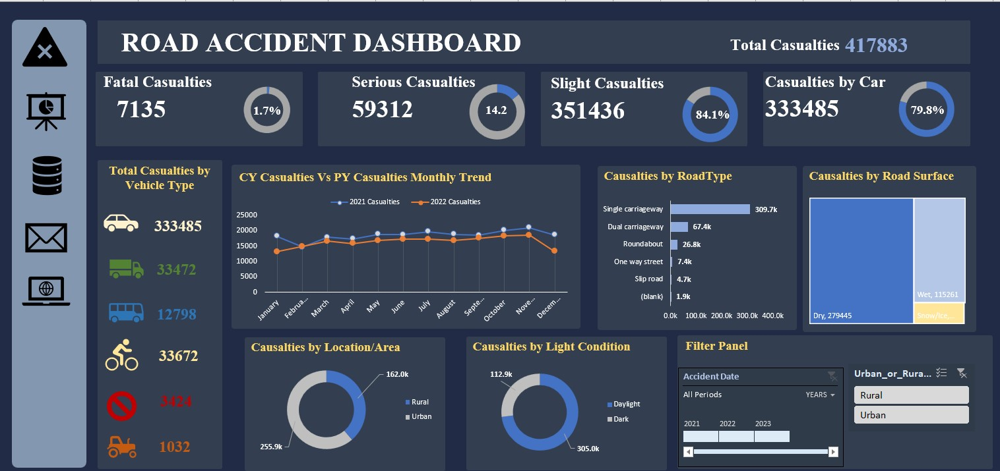
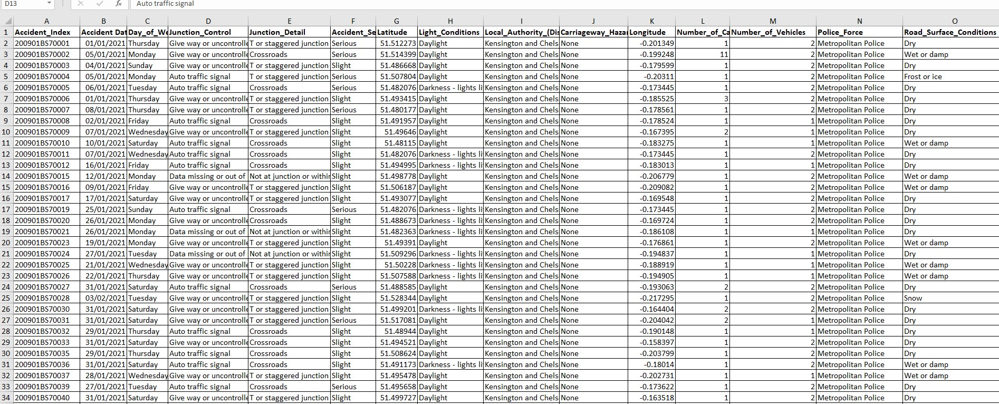
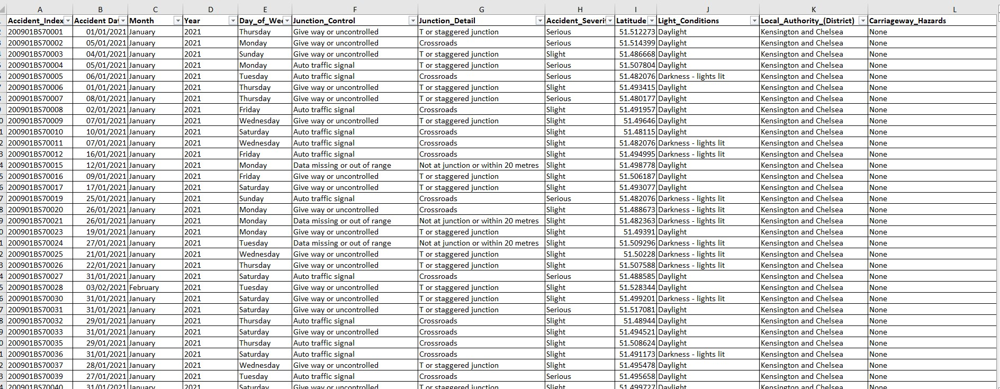
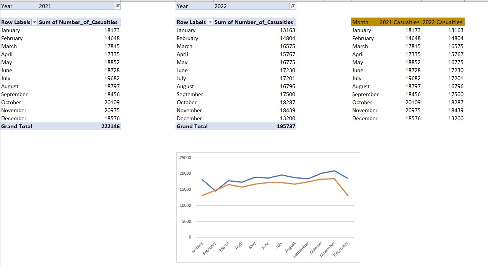
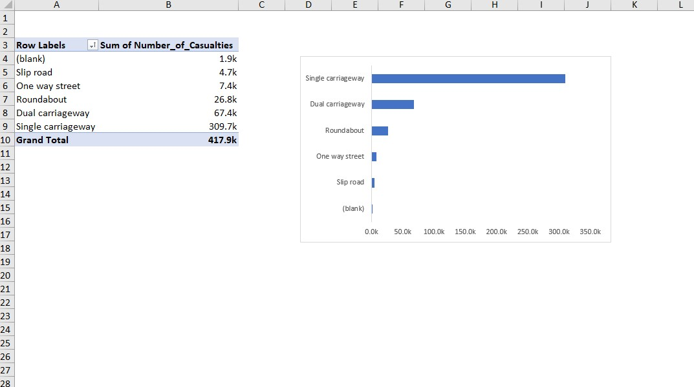
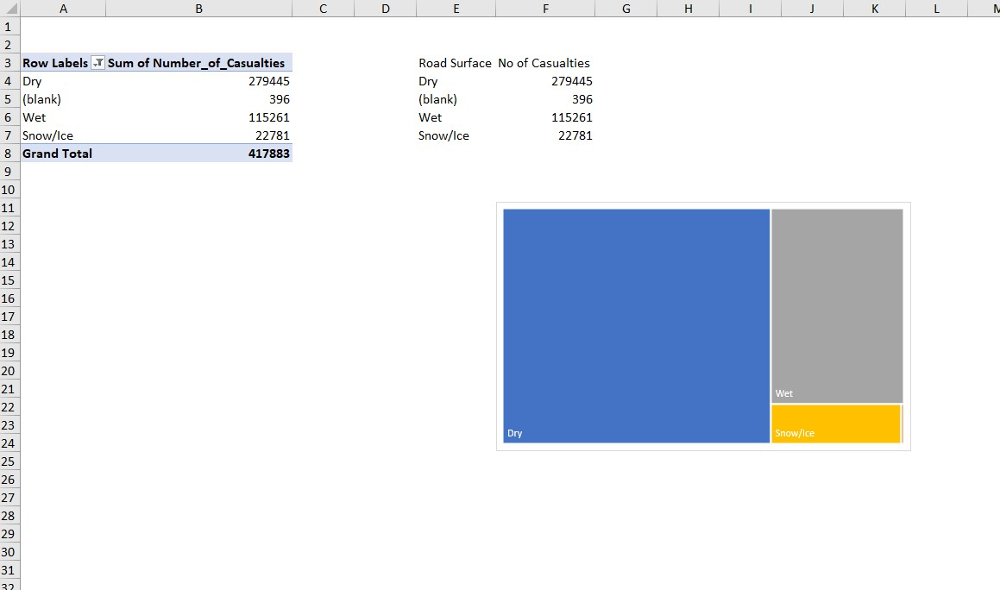
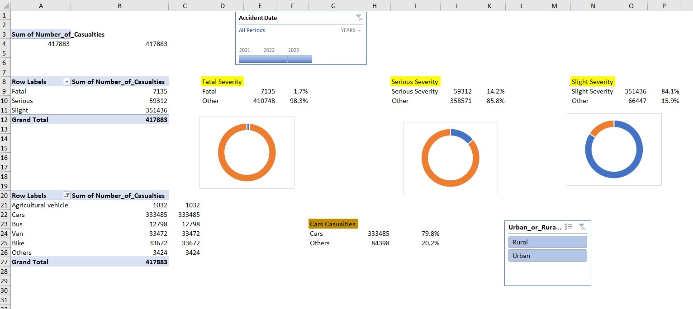
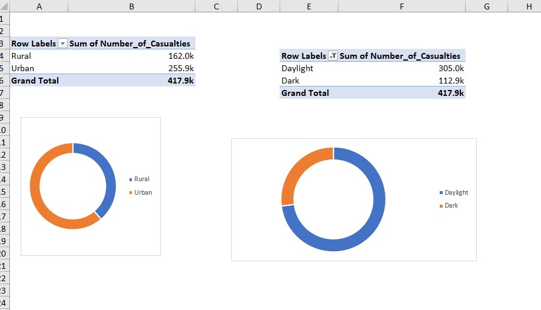
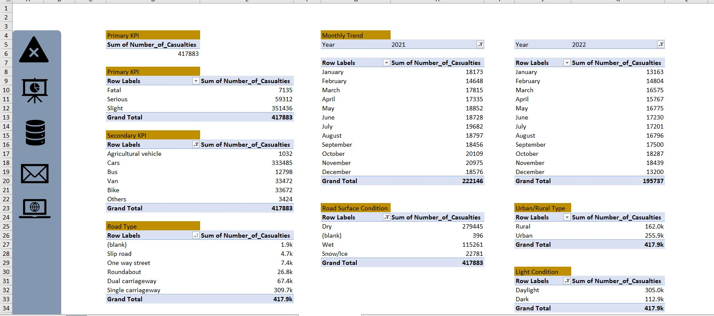

# Road-Accident-Analysis

___

## Introduction

This is a Microsoft Excel Project on **Road Accident Analysis**. The project is to analyse and derive insights to answer important questions and help stakeholders make data driven decision. 📊

**_Disclaimer_**: _The dataset is a dummy dataset for the sole purpose of exploring my Ms Excel skill._ 😉
___
## Problem Statement
Stakeholders wants to create a dashboard for the year 2021 and 2022, so they can have insight on the following requirement;
1.	Primary KPI – Total Casualties taken place after the accident
2.	Primary KPI’s – Total Casualties & Percentage of total with respect to accident severity and maximum Casualties by type of vehicle
3.	Secondary KPI’s – Total Casualties with respect to vehicle type
4.	Monthly trend showing comparison of casualties for the year 2021 and 2022
5.	Maximum Casualties by road typeint
6.	Distribution of total Casualties by road surface
7.	Relation between Casualties by area/location & day/night
___

___

## Skills/ Concept Demonstrated
The following concepts were incorporated:
- Filter
- Pivot tables
- Charts
- Page navigation
 ___

## Analysis and Visualization
The workbook consists of different sheets;
Raw data, Cleaned data, Data Analysis sheet, Donut, Monthly Pivot, Pivot, Road Type, Tree Map

- **Raw Data** has 3.07 million rows with 21 fields, Accident_Index representing the primary key. ⏬

 

- **Cleaned Data sheet** is the result of data cleaning on the raw data sheet. The data cleaning involves correction of some spellings, checking for missing data/values, adding some customized columns and using excel functions. ⏬

  
- **Monthly Pivot sheet** shows the relationship between each month and the casualties for year 2021 and 2022 ⏬

- **Road Type sheet** shows the number of casualties for different types of roads ⏬

- **Tree map sheet** shows the number of casualties for different weather condition ⏬
 

- **Pivot sheet** represents the sum of all casualties, the sum of all casualties filtered by accident severity and vehicle type ⏬

- **Donut sheet** shows casualties filtered by location/area and light condition ⏬

- **The Data Analysis sheet** shows all the pivot tables that were used in drawing our conclusions and dashboard. ⏬
  

___

## Conclusion and Recommendation

- The total casualties for year **2021** and **2022** are 417883
- Slight casualties have 84.1%, **Serious Casualties** have 14.2% while **Fatal Casualties** have 1.7%.
- Casualties in **Urban areas** are more than **Rural areas**.
- Casualties in **daylight** are more than that of **dark**.
- Casualties are caused by **cars**, far more than other vehicle types.

 ## Thank you  😉 👍

